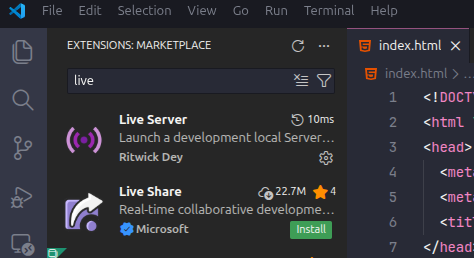
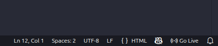
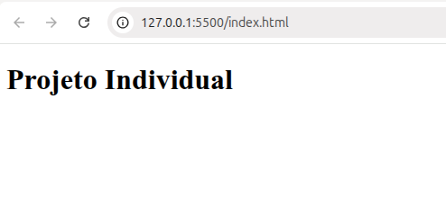

# Projeto Individual - Frontend

Este é o frontend do Projeto Individual desenvolvido com HTML, CSS e JavaScript.

## Pré-requisitos

- Visual Studio Code (VS Code)
- Extensão Live Server instalada no VS Code

## Instalando o Live Server

1. Abra o Visual Studio Code
2. Clique no ícone de extensões na barra lateral esquerda (ou pressione `Ctrl+Shift+X`)
3. Pesquise por "Live Server"
4. Clique em "Install" na extensão **Live Server** de Ritwick Dey



## Como Executar o Projeto

### Opção 1: Usando o botão "Go Live"

1. Abra o arquivo `index.html`
2. Clique com o botão direito no arquivo `index.html` e selecione **"Open with Live Server"**
   
   OU
   
   Clique no botão **"Go Live"** no canto inferior direito da janela do VS Code



### Opção 2: Usando o menu de contexto

1. Clique com o botão direito no arquivo `index.html` no explorador de arquivos
2. Selecione **"Open with Live Server"**

## Acessando a Aplicação

Após iniciar o Live Server, o navegador padrão abrirá automaticamente em:

```
http://127.0.0.1:5500/index.html
```

ou

```
http://localhost:5500/index.html
```

O Live Server irá recarregar automaticamente a página sempre que você salvar alterações nos arquivos HTML, CSS ou JavaScript.



## Parando o Servidor

Para parar o Live Server, clique no botão **"Port: 5500"** no canto inferior direito do VS Code ou feche o VS Code.

